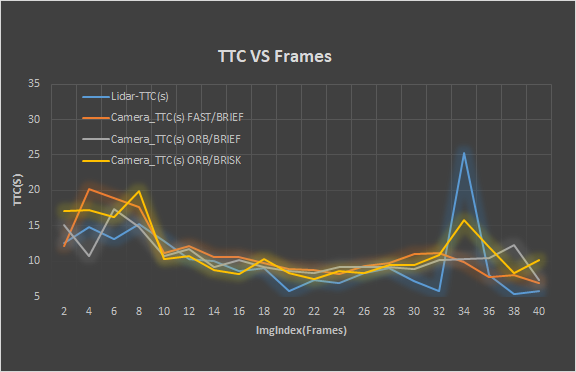

# SFND 3D Object Tracking

By combining all these knowledge of keypoint detectors/descriptors, the YOLO deep-learning framework, and finally, associating regions in a camera image with Lidar points in 3D space,  I successfully finished computing TTC(time-to-collision) based on camera and lidar.  

In the project,  I completed these major tasks:

1. Fist, I made use of yolov3 to find the bounding boxes on the image so as to find corresponding Lidar points and keypoint matches on preceding car.
2. Second, I cropped Lidar points on the preceding car so that I can compute the TTC using the Lidar.
3. Third,  based on [Mid-term Project](https://github.com/lilyhappily/SFND_P3_2D_Feature_Tracking),  I used top three detector/descriptor combinations to match keypoints of  two successive frames.
4. Forth, I matched the corresponding boxes  between the previous and the current frames  with the highest number matches of keypoint correspondences.
5. Lastly, before computing TTC on Lidar and Camera, I implemented the TTC estimation in a way that makes it robust against outliers which might be way too close and thus lead to faulty estimates of the TTC.

The results are obtained by FAST/BRIEF combination on every two frames:


## Part1 : Match 3D Objects

In this part,  I created a `map<int, int>` variant to store the bounding box ID which keypoints are matched  in the bounding boxes of two successive frames. In order to check the results, I put every bounding box ID on the objected detection image.

```C++
void matchBoundingBoxes(std::vector<cv::DMatch> &matches, std::map<int, int> &bbBestMatches, DataFrame &prevFrame, DataFrame &currFrame)
{
    
    // DMatch: queryIdx, trainIdx can find the cooresponding keypoints in prevFrame and currFrame.
    // queryIdx->prevFrame, trainIdx->currFrame
    // First Part: find the preFrame's matches in its every boundingBox, that is to fill 
    // the kptMatches attribute of boundingBox in head file dataStructures.h.
    for(auto it1 = matches.begin(); it1 != matches.end(); ++it1)
    {
        int trainIdx = it1->trainIdx;
        cv::KeyPoint currKeypoint = currFrame.keypoints[trainIdx];
        vector<vector<BoundingBox>::iterator> currEnclosingBoxes;
        for(auto it2 = currFrame.boundingBoxes.begin(); it2 != currFrame.boundingBoxes.end(); ++it2)
        {
            if(it2->roi.contains(currKeypoint.pt))
            {
                currEnclosingBoxes.push_back(it2);
            }
        }
        if(currEnclosingBoxes.size() == 1)
        {
            currEnclosingBoxes[0]->kptMatches.push_back(*it1);
            currEnclosingBoxes[0]->keypoints.push_back(currKeypoint);
        }
    }
 
    for(auto it1 = currFrame.boundingBoxes.begin(); it1 != currFrame.boundingBoxes.end(); ++it1)
    {// first for loop is to go through all the boundingBoxes of prevFrame 
        multimap<int, int> records; 
        for(auto it2 = it1->kptMatches.begin(); it2 != it1->kptMatches.end(); ++it2)
        {// second loop is to go through the matches in every precFrame's boundingBox.
            int queryIdx = it2->queryIdx;
            for(auto it3 = prevFrame.boundingBoxes.begin(); it3 != prevFrame.boundingBoxes.end(); ++it3)
            {
                if(it3->roi.contains(prevFrame.keypoints[queryIdx].pt))
                {
                    records.insert(pair<int, int>(it3->boxID, queryIdx));
                }
            } 
        }
        int max = 0;
        int index;
        if(records.size() > 0)          {
            for(auto it4 = records.begin(); it4 != records.end(); ++it4)
            {
               if(records.count(it4->first) > max)
               {
                   max = records.count(it4->first);
                   index = it4->first;
               }
                
            }
        }
        bbBestMatches.insert(pair<int, int>(index, it1->boxID)); 
    }
}
```

## Part2 : Compute Lidar-based TTC

By searching for the closest points  in the point cloud associated with  `lidarPointsPrev`and in the point cloud associated with `lidarPointsCurr`, the TTC is computed based on the the closest points. Before computing the TTC,  [`StatisticalOutlierRemoval` ](http://pointclouds.org/documentation/tutorials/statistical_outlier.php)of PCL library was used to remove the outliers of Lidar point cloud.  At the same time, I revised the original [ `CMakeList.txt`]()  of the project so as to run the PCL library in my project.

```C++
// This function is used to remove LidarPoint outliers before computing TTC.
std::vector<LidarPoint> removeLidarOutliers(std::vector<LidarPoint> &lidarPoints)
{
    pcl::PointCloud<pcl::PointXYZI>::Ptr cloud(new pcl::PointCloud<pcl::PointXYZI>());
    pcl::PointCloud<pcl::PointXYZI>::Ptr cloud_filtered(new pcl::PointCloud<pcl::PointXYZI>());
    for(auto it = lidarPoints.begin(); it!=lidarPoints.end(); ++it)
    {
        pcl::PointXYZI point;
        point.x = it->x;
        point.y = it->y;
        point.z = it->z;
        point.intensity = it->r;
        cloud->points.push_back(point);
    }
    cloud->width = cloud->points.size();
    cloud->height = 1;

    // Removing outliers using a StatiscalOutlierREmoval filter PCL API
    pcl::StatisticalOutlierRemoval<pcl::PointXYZI> sor;
    sor.setInputCloud(cloud);
    sor.setMeanK(100);
    sor.setStddevMulThresh(0.25);
    sor.filter(*cloud_filtered);

    // Change back to the LidarPoint type
    std::vector<LidarPoint> lidarPointsFiltered;
    for(auto it : cloud_filtered->points)
    {
        LidarPoint lidarPoint;
        lidarPoint.x = it.x;
        lidarPoint.y = it.y;
        lidarPoint.z = it.z;
        lidarPoint.r = it.intensity;
        lidarPointsFiltered.push_back(lidarPoint);
    }

    return lidarPointsFiltered;
}
```

## Part3: Compute Camera-based TTC

First, I added the keypoint matches to the bounding box, and then computed the TTC estimate based on the distance ratios of matched keypoints between successive images.  In order to remove wrong matches,  I  computed a robust mean of all the Euclidean distances between keypoint matches. These distance larger than 1 standard deviation of the mean distance to the query point will be marked as outliers and removed.

```C++
void clusterKptMatchesWithROI(BoundingBox &boundingBox, std::vector<cv::KeyPoint> &kptsPrev, std::vector<cv::KeyPoint> &kptsCurr, std::vector<cv::DMatch> &kptMatches)
{
    vector<cv::DMatch> matchesROI;
    for(auto it = kptMatches.begin(); it != kptMatches.end(); ++it)
    {
        cv::KeyPoint currKeypoint = kptsCurr[it->trainIdx];
        if(boundingBox.roi.contains(currKeypoint.pt))
        {
            matchesROI.push_back(*it);
        } 
    }
    // remove match outliers
    // compute the matches distance mean and deviation
    vector<double> matchesDist;
    for(auto it = matchesROI.begin(); it != matchesROI.end(); ++it)
    {
        matchesDist.push_back(it->distance);
    }
    cout << "before matchesDist.size(): " << matchesDist.size() << endl;
    // compute mean
    double sum = accumulate(matchesDist.begin(), matchesDist.end(), 0);
    double mean = sum / matchesDist.size();

    // compute covariance
    double diffDistSum = 0;
    for_each(matchesDist.begin(), matchesDist.end(), [&](const double d) {
        diffDistSum += (d - mean) * (d - mean);
    });

    // remove the matches which distance to mean > stddev 
    double stddev = sqrt(diffDistSum / (matchesDist.size() - 1));
    
    for(auto it = matchesDist.begin(); it != matchesDist.end();)
    {
        double dist = *it - mean;
        if(fabs(dist) > 1.0*stddev)
        {
            it = matchesDist.erase(it);
        }else
        {
            ++it;
        }    
    }
    boundingBox.keypoints.clear();
    boundingBox.kptMatches.clear();
    
    for(auto it = matchesROI.begin(); it != matchesROI.end(); ++it)
    {
        auto iter = find(matchesDist.begin(), matchesDist.end(), it->distance);
        if(iter != matchesDist.end())
        {
            boundingBox.kptMatches.push_back(*it);
            boundingBox.keypoints.push_back(kptsCurr[it->trainIdx]);
        }
    }
}
```

## Performance Evaluation

Top three detector/descriptor combinations of **FAST/BRIEF, ORB/BRIEF and ORB/BRISK** from [Mid-term Project](https://github.com/lilyhappily/SFND_P3_2D_Feature_Tracking) were used to compute the TTC based on camera. From the successive frames, I know the preceding car is little by little close to the ego car, so the TTC is decreasing with the frames. 

During computing the Camera-TTC , median was used.  It is possible for two successive frames that previous median is equal to current median, and this will have a result TTC=NAN.  I set the parameters  `imgEndIndex = 40` and `imgStepWidth = 2`  which stands for computing TTC every two images. The results were computed in my [results.xlsx](./results.xlsx).

<div align=center> </div>
From above chart, we can see that the TTC change trend is decreasing with the frames. I used `minXpoint`  of lidar measurements between previous frame and current frame to compute TTC, even though `pcl::StatisticalOutlierRemoval` was used to remove outliers,  the result is fluctuate greatly especially on frame 34. If we only make use of lidar point to compute TTC, this will result in faulty measurement. That is the reason the lidar measurements are inaccurate with white noise,  and we can get more accurate result by filtering the noise with **Kalman Filter**. 

Besides, TTC only based on camera is also not accurate enough. When the preceding car is more and more close to the ego car, the `matchBoundingBoxes` gives a big wrong result like the below image. When the bounding boxes overlaps a lot with each other, the function `matchBoundingBoxes` becomes invalid. I have tried my best , but have not found a valid way. Both TTC-computed methods are not enough when considering the Z dimensions which means the road is not flat. The algorithm computing TTC based on Lidar and camera is derived from Plane Trigonometry. If the road is not flat. the algorithm is invalid. 


## Dependencies for Running Locally

* cmake >= 2.8
  * All OSes: [click here for installation instructions](https://cmake.org/install/)
* make >= 4.1 (Linux, Mac), 3.81 (Windows)
  * Linux: make is installed by default on most Linux distros
  * Mac: [install Xcode command line tools to get make](https://developer.apple.com/xcode/features/)
  * Windows: [Click here for installation instructions](http://gnuwin32.sourceforge.net/packages/make.htm)
* Git LFS
  * Weight files are handled using [LFS](https://git-lfs.github.com/)
* OpenCV >= 4.1
  * This must be compiled from source using the `-D OPENCV_ENABLE_NONFREE=ON` cmake flag for testing the SIFT and SURF detectors.
  * The OpenCV 4.1.0 source code can be found [here](https://github.com/opencv/opencv/tree/4.1.0)
* gcc/g++ >= 5.4
  * Linux: gcc / g++ is installed by default on most Linux distros
  * Mac: same deal as make - [install Xcode command line tools](https://developer.apple.com/xcode/features/)
  * Windows: recommend using [MinGW](http://www.mingw.org/)

## Basic Build Instructions

1. Clone this repo.
2. Make a build directory in the top level project directory: `mkdir build && cd build`
3. Compile: `cmake .. && make`
4. Run it: `./3D_object_tracking`.
